# 텔레그램 알림 플로우

## 한눈에 보기

```
┌─────────────────────────────────────────────────────────────────────────────────┐
│                        텔레그램 알림 플로우                                         │
├──────────────────────────────────────┬────────────────────────────────────────────┤
│  📢 채널 구독 (전체 브로드캐스트)       │  👤 개인 알림 (마이페이지 연동)              │
├──────────────────────────────────────┼────────────────────────────────────────────┤
│                                      │                                            │
│  채널 초대 링크 클릭                   │  웹 로그인 → 마이페이지                     │
│         ↓                            │         ↓                                  │
│  텔레그램 채널 가입                    │  관심 리스트 + 매수/매도 기준(%) 설정 후 저장   │
│         ↓                            │         ↓                                  │
│  매일 09:30(KST) 1회                  │  「텔레그램 알림 연결」 클릭                   │
│         ↓                            │         ↓                                  │
│  전체 ETF 괴리율 요약 메시지 수신       │  봇 대화에서 「시작하기」 탭                    │
│  (채널에 포스트 → 모든 채널 구독자 동일)  │         ↓                                  │
│                                      │  관심 리스트가 봇 구독으로 동기화 (DB·Redis)   │
│                                      │         ↓                                  │
│                                      │  매일 09:30 조건 충족 시                      │
│                                      │  → 해당 유저 채팅방에만 개인 알림 발송          │
└──────────────────────────────────────┴────────────────────────────────────────────┘
```

## Mermaid 플로우차트

```mermaid
flowchart TB
  subgraph channel["📢 채널 구독 (전체 브로드캐스트)"]
    A1[채널 초대 링크 클릭] --> A2[텔레그램 채널 가입]
    A2 --> A3[매일 09:30 KST 1회]
    A3 --> A4[전체 ETF 괴리율 요약 수신]
    A4 --> A5[(같은 메시지를 모든 채널 구독자가 봄)]
  end

  subgraph personal["👤 개인 알림 (마이페이지 연동)"]
    B1[웹 로그인 → 마이페이지] --> B2[관심 리스트 + 매수/매도 기준 설정 후 저장]
    B2 --> B3[텔레그램 알림 연결 클릭]
    B3 --> B4[봇 대화에서 시작하기 탭]
    B4 --> B5[관심 리스트 → 봇 구독 동기화]
    B5 --> B6[(DB: users.telegram_id, Redis: 구독 목록)]
    B6 --> B7[매일 09:30 조건 충족 시]
    B7 --> B8[해당 유저 채팅방에만 개인 알림]
  end

  title[텔레그램 알림 플로우]
```



## 요약

| 구분 | 채널 구독 | 개인 알림 |
|------|-----------|-----------|
| **진입** | 채널 링크로 채널 가입 | 마이페이지에서 봇 연결 + /start |
| **설정** | 없음 | 관심 리스트·매수/매도 % (마이페이지) |
| **수신 내용** | 매일 전체 ETF 요약 1통 | 조건 충족한 ETF만 해당 유저에게 1:1 메시지 |
| **저장** | 없음 | DB `users.telegram_id`, Redis 구독 목록 |

- **CRON** (`/api/telegram/cron`): 매일 09:30에 ① 채널 브로드캐스트 1통 + ② 구독 목록 순회하며 조건 충족 시 각 `chat_id`로 개인 메시지 전송.
